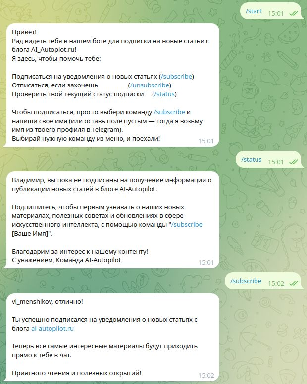
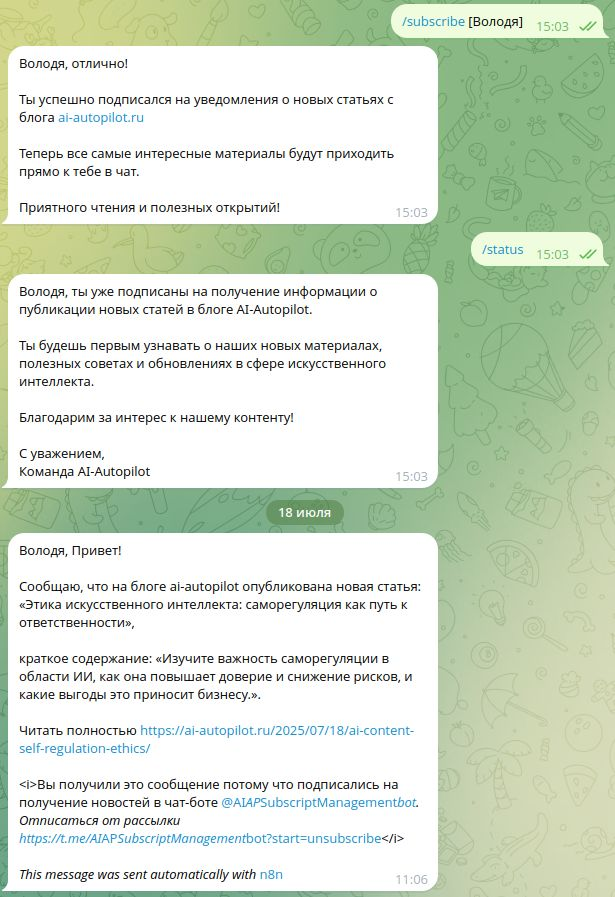
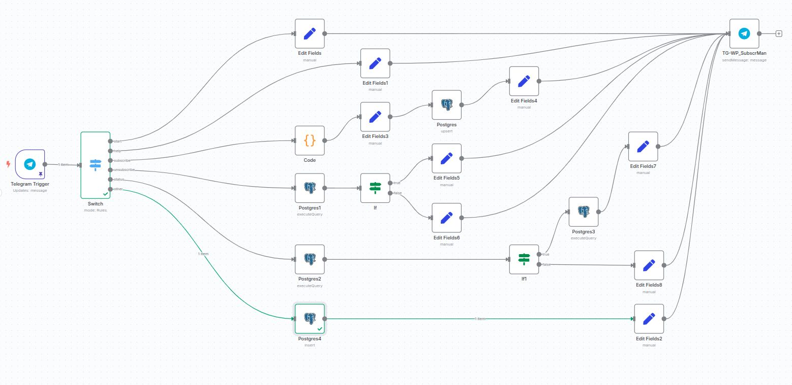

# WordPress Blog Telegram Bot

Автоматизированная система уведомлений для блога на WordPress с интеграцией Telegram-бота для управления подписками.

## 📸 Скриншоты

Демонстрирует начальный этап работы с ботом:
- Первый запуск бота командой `/start`
- Проверка статуса подписки до оформления подписки
- Интерфейс команды `/status` для неподписанного пользователя
- Процесс подписки через команду `/subscribe`

Показывает полный цикл взаимодействия подписанного пользователя:
- Успешное оформление подписки
- Получение уведомления о новой публикации в блоге
- Формат сообщения с названием статьи, кратким содержанием и ссылкой
- Проверка статуса для подписанного пользователя

Архитектура рабочего процесса системы:

--- 

Все скриншоты находятся в папке `/img` в корне проекта.
